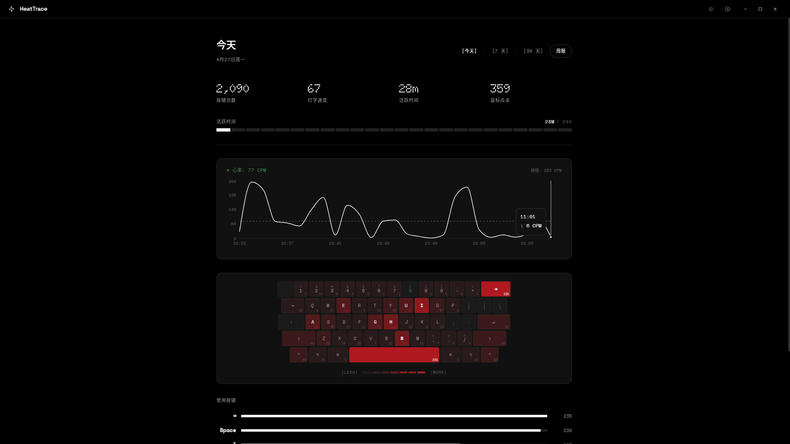
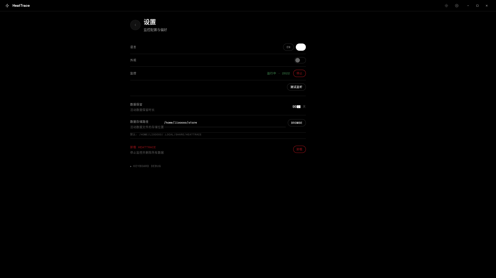
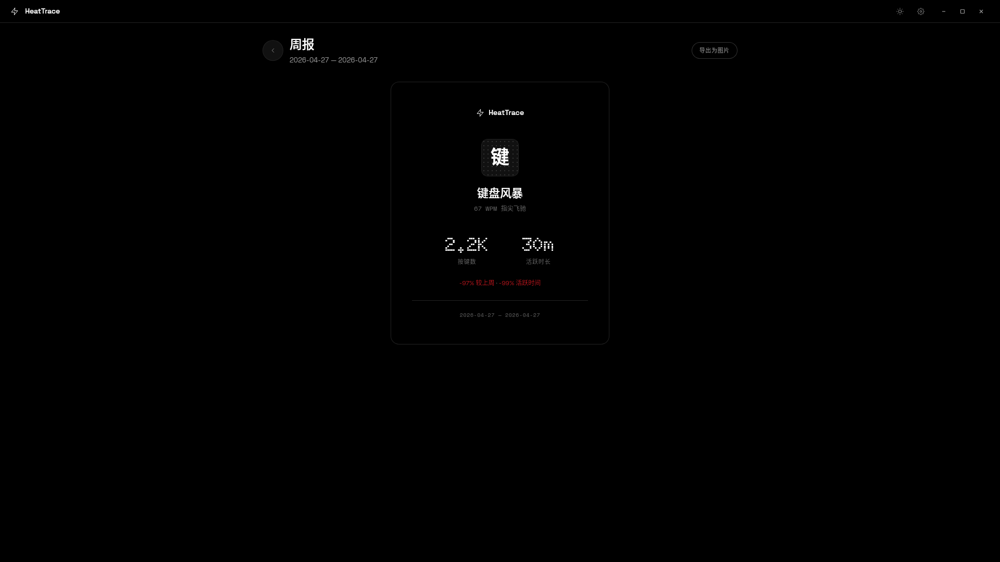

<div align="center">


# HeatTrace

**Desktop activity tracker for keyboard & mouse**

[](https://github.com/liooooo29/HeatTrace/actions/workflows/build.yml)


Keystrokes, typing speed, mouse clicks — all tracked locally on your machine. No cloud, no account, no telemetry.

</div>

---

## Screenshots

<table align="center">
  <tr>
    <td align="center"></td>
    <td align="center"></td>
    <td align="center"></td>
  </tr>
</table>

## Features

- **Real-time dashboard** — live keystrokes, WPM, active time, mouse clicks with auto-refresh
- **Typing ECG** — heartbeat-style visualization of your coding rhythm (CPM per minute)
- **Keyboard heatmap** — visual key frequency heatmap mapped to a physical keyboard layout
- **Commonly used keys** — top 10 keys ranked by proportional bar chart
- **Weekly report** — typing style analysis, daily/hourly trends, shareable image export
- **Top Apps** — track which applications consume your time
- **System tray** — daily summary in the tray, runs in background
- **Dark & Light mode** — Nothing-inspired monospace UI, OLED black or off-white
- **i18n** — English and Chinese
- **Data retention** — auto-cleanup with configurable retention period
- **Custom data directory** — choose where your data lives
- **100% local** — no cloud, no account, all data stays on your disk

## Install

### Download

Grab the latest release for your platform from [Releases](https://github.com/liooooo29/HeatTrace/releases).

### Build from source

**Prerequisites:** Go 1.22+, Node.js (pnpm), [Wails CLI](https://wails.io/docs/gettingstarted/installation)

```bash
# Install Wails CLI
go install github.com/wailsapp/wails/v2/cmd/wails@latest

# Build for your platform
wails build

# Or run in dev mode
wails dev
```

#### Linux (Ubuntu 24.04)

```bash
# Install webkit2gtk dependency
sudo apt install libwebkit2gtk-4.1-dev

# Build with webkit2_41 tag
wails build -tags webkit2_41
```

## Tech Stack

| Layer    | Stack                                |
| -------- | ------------------------------------ |
| Backend  | Go + [Wails v2](https://wails.io)    |
| Frontend | React + TypeScript + Tailwind CSS    |
| Charts   | Recharts                             |
| Hooks    | [gohook](https://github.com/robotn/gohook) |
| Storage  | Local JSON (gzip compressed)         |
| Design   | [Nothing Design System](https://github.com/anthropics/claude-code) |

## Architecture

```
HeatTrace/
├── main.go              # App entry, Wails bootstrap, single-instance lock
├── tray.go              # System tray with daily summary
├── app.go               # Wails-bound methods (frontend ↔ Go bridge)
├── monitor/             # Keyboard & mouse event capture (gohook)
├── storage/             # JSON store, aggregator, daily summaries
├── analytics/           # Typing speed, usage time, weekly reports
├── filter/              # Sensitive key filtering
├── config/              # App configuration
└── frontend/            # React SPA (Vite + Tailwind)
```

## Privacy

HeatTrace runs entirely on your machine. No data is sent anywhere. You can review exactly what is stored by opening the JSON files in your data directory. Sensitive keys (password fields) are automatically filtered out.

## License

[MIT](LICENSE)
